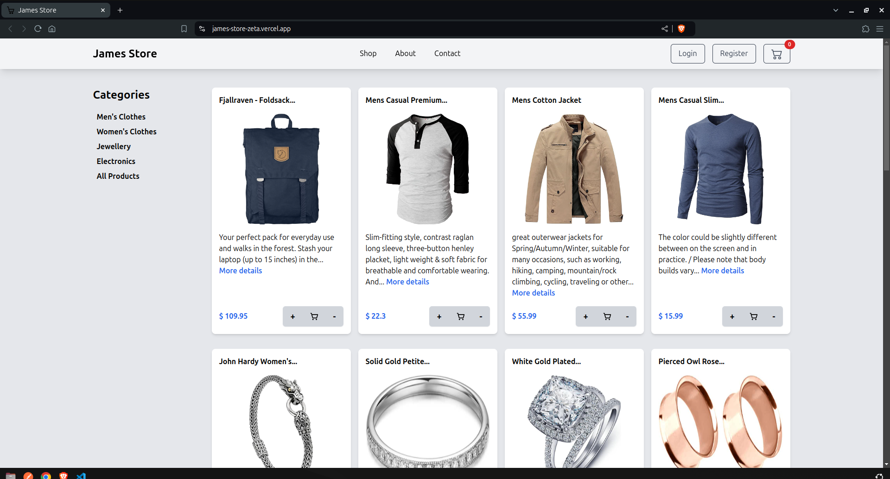
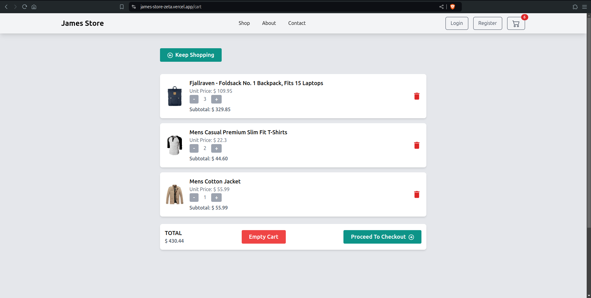
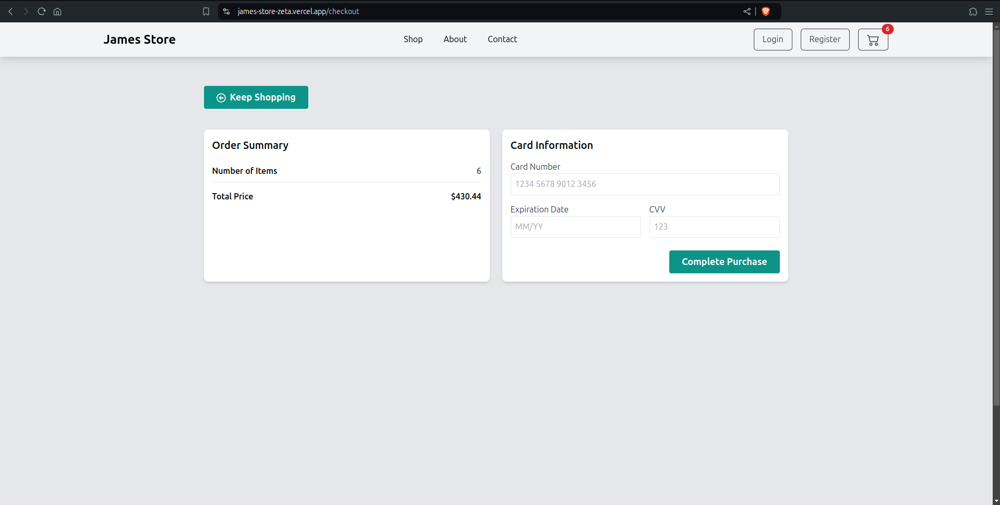

# James Store

An mock ecommerce platform built with React, Vite, and Tailwind CSS.

## Table of Contents

- [Description](#description)
- [Installation](#installation)
- [Usage](#usage)
- [Features](#features)
- [Screenshots](#screenshots)
- [Technologies](#technologies)
- [Contributing](#contributing)
- [License](#license)
- [Contact](#contact)

## Description

This app is an online store offering a range of products with features like a shopping cart, view products by category, order summary and checkout.

This app consumes the fakestore API. Here is its [documentation](https://fakestoreapi.com/docs) and [GitHub Repo](https://github.com/keikaavousi/fake-store-api)

## Installation

### Prerequisites

- Node.js
- npm (Node Package Manager)

### Installation Steps

1. Clone the repository:

   ```bash
   git clone git@github.com:jimmindungu3/James-Store.git
   ```

2. cd to the repository and install the dependencies

   ```bash
   cd James-Store
   npm install
   ```

3. Start the development server
   ```bash
   npm run dev
   ```

## Usage

After starting the development server, you can access the app at `http://localhost:5157`. Browse products, add them to your cart, and proceed to checkout. The app provides a smooth user experience with intuitive navigation and responsive design.


## Features

- Product listing and categorization
- Shopping cart functionality
- Order summary and checkout
- Responsive design

## Screenshots

;

;

;

## Technologies

- React
- Vite
- Tailwind CSS
- Axios
- React Router
- UseContext

## Contributing

Contributions are welcome! Please follow these steps:

1. Fork the repository
2. Create a new branch (git checkout -b feature-branch)
3. Make your changes
4. Commit your changes (git commit -m 'Add some feature')
5. Push to the branch (git push origin feature-branch)
6. Open a pull request

## License

This project is licensed under the MIT License - see the LICENSE file for details.

## Contact

- Check out my [portfolio](https://jimmindungu3.github.io/portfolio/).
- Connect with me on [LinkedIn](https://www.linkedin.com/in/jamesndunguthedev/).
- Check out my [YouTube Channel](https://youtube.com/@DevsToday) for tech content.
- Follow me on X [@jimmindungu3](https://twitter.com/jimmindungu3).
- Email me at jamesthesuperdev@gmail.com for any inquiries or collaboration opportunities.
- WhatsApp or Call: +254 717 055 495
